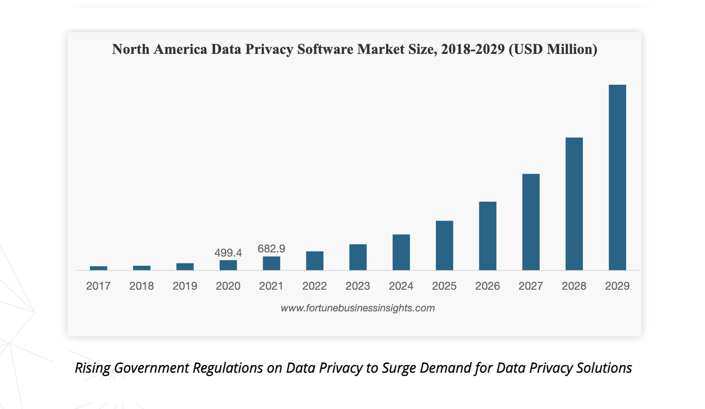

*`Draft version 0.2`*
# Using this document

This document is a detailed description of the GotaBit Network technology.  GotaBit built a specific blockchain application from ground up using GotaBitSDK, Tendermint core and other associated technologies seamlessly.  

The following are quick links to relevant sections of the document. 

1. [About GotaBit](/docs/overview/about.md)

1. [Hardware & Software requirements](/docs/node/pre-requisites/techenv.md)

1. [Quick Start](/docs/node/setup/instruction-steps.md)

1. [Governance](/docs/governance/overview.md)

## Data privacy and security

From Fortune Business Insights research report on [Data Privacy Software Market Size](https://www.fortunebusinessinsights.com/infographics/data-privacy-software-market-105420), the North American data privacy software market is valued at USD1.68B in 2021 and it is forecasted to reach USD25.85B in 2029 with a significant growth of CAGR 40.8%.  

  

In contrast, data privacy and protection from non-digital means is embraced by rising government policy framework such as EU General Data Protection Regulation or [GDPR](https://gdpr-info.eu/).  Infringement of GDPR law carries heavy penalties. For example, [EU fined Meta $400M for privacy breach](https://techcrunch.com/2023/01/04/facebook-instagram-gdpr-forced-consent-final-decisions/).

The key driving factors are data from the Internet of Things devices (IoT). Research is also conducted on the Internet of Vehicles (IoV) with the emergence of blockchain technology for tracking data of vehicles.

Companies that are in the Web3 internet space will ensure that their user data is protected and secured. Without it and the lack of owners control, the scale of sharing data transactions and data consumer search will increase with fraud and leaks.

Blockchain technology can provide data protection and security. Using smart contracts running on a blockchain platform, data is validated, implemented and then shared across a Peer-to-Peer (P2P) decentralized network using a Distributed Ledger Technology (DLT) that is available for all parties to provide transparency and accountability.

A blockchain that natively supports data protection and security is required. 

