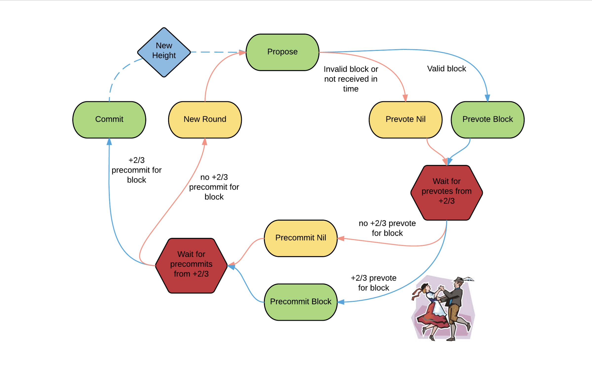

# Basic concepts
This section provides a condensed overview of the basic concepts of the GotaBit decentralized blockchain network. A more detailed discussion can be found from the references given below.

## Why GotaBit blockchain
GotaBit blockchain has the following features that makes it stand out.
1. Scalability. There are more transactions processed compared to other blockchain platforms.
1. Usability.  It has a straight forward, simple infrastrurture that can be used to develop a blockchain from a well constructed software development kit (SDK).
1. Interoperability.
GotaBit blockchain in a network landscape uses an inter blockchain communications (IBC) protocol to interact with other heterogenous blockchains. There are a whole host of projects developed successfully; or, are still under development using this interoperability. IBC is drafted to be an industry standard [Interchain Standards](https://github.com/cosmos/ibc).

## GotaBitSDK
GotaBit software development kit (GotaBitSDK) is to ensure that further application development uses the GotaBit framework.  This framework acts like a standards guideline for module analysis, design and building a complex blockchain ecosystem. GotaBitSDK also provide modules for transaction and query processing, accounts, gas and fee calculations.

## Tendermint Core
Tendermint Core is a blockchain consensus engine.  Blocks are created in Tendermint Core, proposed, voted by participating nodes, submitted for adding to the blockchain using a BFT algorithm.  

###	Byzantine Fault Tolerent (BFT) consensus model
Tendermint uses a BFT consensus model.  A BFT validating process (or validator) require at least two-thirds of the passed votes in order to commit a block proposal before it is added to the  blocks in the blockchain.  Once included in the block, transaction finality is reached immediately without block confirmations.   An important BFT decision flowchart is given below

  

*Picture 1. Tendermint Core BFT consensus algorithm*

>:memo: **References**
- Cosmos SDK [Cosmos Software Development Kit Documentation](https://docs.cosmos.network/main) 
- Tendermint Documentation [Using Tendermint](https://docs.tendermint.com/v0.34/tendermint-core/using-tendermint.html#)
- Tendermint Wiki [Tendermint Overview](https://golden.com/wiki/Tendermint-4AP8KX8#Overview)