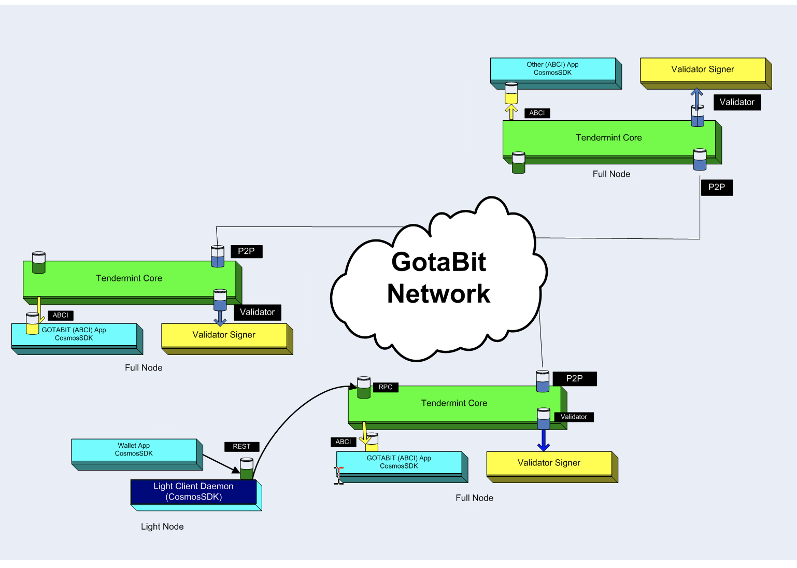

# GotaBit Network Application Landscape

The GotaBit Network application landscape consists of full nodes each with an instance of Tendermint Core integrated with a GotaBit application blockchain developed under the Cosmos framework. It communicates with the Tendermint Core using the network layer application blockchain interface (ABCI). 

GotaBit background modules are used to interact between light clients such as wallet applications with the network using REST and RPC.

  
)  
  
*Picture 2. GotaBit Network Application Landscape*

## Application Blockchain Communications Interface (ABCI)
ABCI is the interface protocol between Tendermint Core and application layer of the Cosmos framework. It acts as a channel of communications between the consensus engine and application module logic running on the node. 

## Full node and light client node
A full node on the network consists of an application blockchain written based on the Cosmos framework,  Tendermint Core, Validator and ABCI interface protocol.

A light client node runs a daemon or continous background process waiting to perform a task. It is a ABCI enabled application on the GotaBit Network.  A client browser then communicates with the daemon running using REST framework.  The light client node also communicates to the full node via a remote process communication (RPC) channel.
